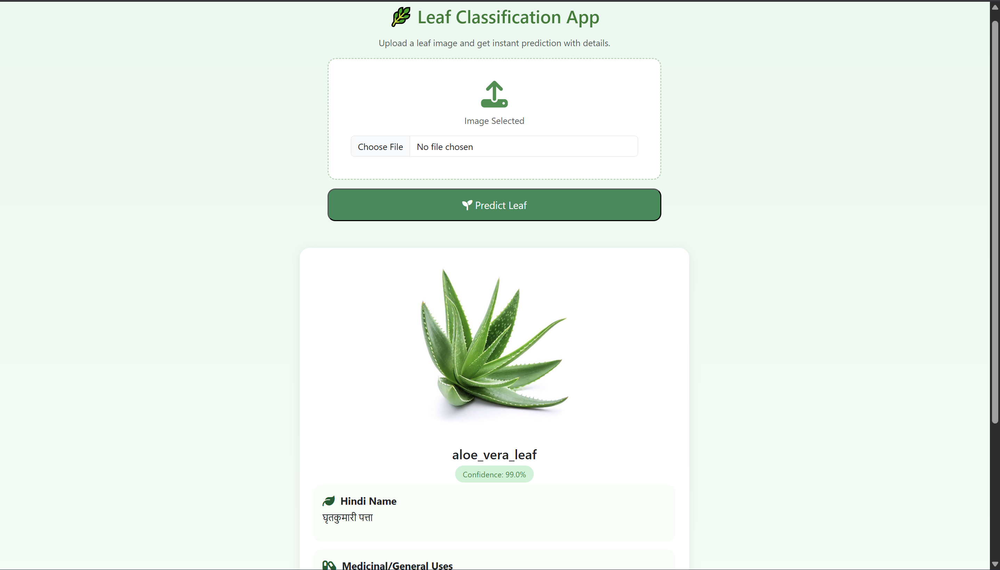

# 🌿 Leaf Classification Web App  
An AI-powered web application that identifies plant leaves using a trained MobileNetV2 deep learning model.  
Upload any leaf image and instantly get:

- ✔ Predicted Leaf Name  
- ✔ Confidence Percentage  
- ✔ Hindi Name  
- ✔ Medicinal / General Uses  
- ✔ Pros  
- ✔ Cons  

This project is built using **Flask**, **PyTorch**, **Bootstrap UI**, and includes a structured CSV-backed knowledge base for leaf information.

---

## 📸 Screenshot  

> Replace `image.png` with the actual screenshot file in your repo.  
> In this ReadMe preview, it's using your uploaded file.

---

## 🚀 Features

- 🌿 AI-powered leaf classification  
- 🧠 Trained MobileNetV2 model (Transfer Learning)  
- 📊 Confidence-based prediction  
- 📚 Integrated leaf knowledge (Hindi Name, Pros/Cons, Uses)  
- 🖼 Image preview  
- 🎨 Modern UI with Bootstrap  
- ☁️ Ready for deployment on Render  

---

## 🧠 Model Details

- **Architecture:** MobileNetV2  
- **Training Approach:** Transfer Learning  
- **Dataset:** 42 Leaf Categories  
- **Image Size:** 224×224  
- **Augmentation:** Resize + Normalize (ImageNet)  
- **Output:** Softmax prediction over all classes  

---

## 🛠 Tech Stack

| Layer | Technology |
|-------|------------|
| Backend | Flask (Python) |
| ML Model | PyTorch + TorchVision |
| Frontend | HTML5, CSS3, Bootstrap 5 |
| Data Processing | Pandas |
| Deployment | Render |
| UI Icons | FontAwesome |

---

## 📂 Project Structure

